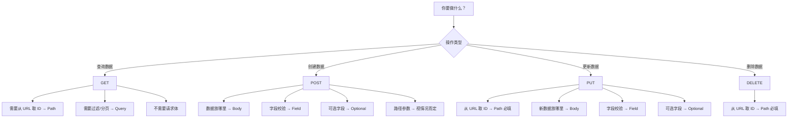

---

## 学习内容

| 章节 | 文件 | 核心知识点 |
|:---|:---|:---|
| 第1章 | `01_path_params.py` | 路径参数、枚举类型 |
| 第2章 | `02_query_params.py` | 查询参数、可选参数 |
| 第3章 | `03_request_body.py` | 请求体、Pydantic 模型 |
| 第4章 | `04_validations.py` | 查询参数和路径参数校验 |
| 第5章 | `05_request_body_validations.py` | 请求体校验、嵌套模型、混合参数 |

---

## 技术栈

- **框架**：FastAPI
- **服务器**：Uvicorn
- **数据校验**：Pydantic
- **数据库**：PostgreSQL（Docker）
- **版本控制**：Git & GitHub

---

## 上手须知

### HTTP 方法选择

本质上就是**增删改查**：

| 方法 | 对应操作 | 说明 |
|:---:|:---:|:---|
| `POST` | **增**（Create） | 创建新数据 |
| `GET` | **查**（Read） | 查询数据 |
| `PUT` | **改**（Update） | 更新已有数据 |
| `DELETE` | **删**（Delete） | 删除数据 |

---

### 参数类型速查

| 参数 | 数据来源 | 用途 |
|:---|:---|:---|
| `Path` | URL 路径 | 从 URL 路径中取值，如 `/items/{id}` |
| `Query` | URL 参数 | 从 `?` 后面取值，如 `?skip=20` |
| `Body` | HTTP 请求体 | 从 JSON 数据中取值 |
| `Field` | 模型内部 | 定义模型中的字段校验规则 |
| `Optional` | 类型注解 | 表示字段可以是 `None` |

> **记忆口诀**：路径用 `Path`，问号用 `Query`，JSON 用 `Body`，模型字段用 `Field`

---

## 完整决策流程图

